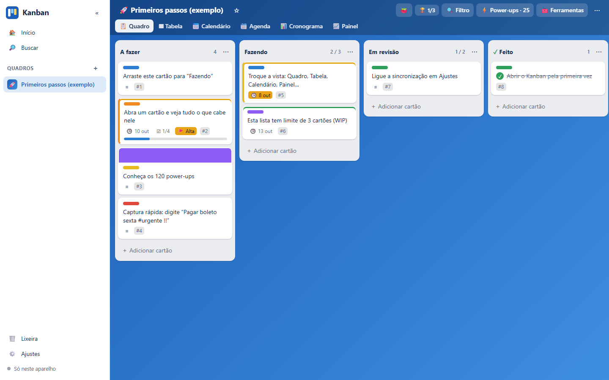

# Kanban

[](https://joaogabrielmontinirossi-sys.github.io/kanban/)

Quadros, listas e cartões para Windows, site e celular, com **120 power-ups**. A base é a do Trello (arrastar cartões entre listas), as vistas e os campos vêm do Notion (tabela, galeria, calendário, campos personalizados) e os processos vêm do Pipefy (formulário de entrada, campos obrigatórios por etapa, SLA, aprovação, automações).

Tudo funciona sem conta e sem servidor: os dados ficam no seu aparelho e, se você ligar, no seu Google Drive.

## Baixar (Windows)

Pegue o `Kanban.exe` na página de [Releases](../../releases/latest) e abra. Não precisa instalar nada: o programa usa o Edge (ou o Chrome) que já está no Windows para mostrar a janela.

Como o arquivo não é assinado, o Windows pode mostrar o aviso do SmartScreen na primeira vez: clique em **Mais informações** e depois em **Executar assim mesmo**.

## No site e no celular

Abra **https://joaogabrielmontinirossi-sys.github.io/kanban/** em qualquer navegador.

- **Android (Chrome)**: ⋮ › *Adicionar à tela inicial*.
- **iPhone/iPad (Safari)**: **Compartilhar** › **Adicionar à Tela de Início**.

Depois de aberta uma vez, a versão web funciona sem internet. No celular, segure o cartão por um instante antes de arrastar.

## Como funciona

| No app | É | Parecido com |
| --- | --- | --- |
| **Quadro** | Um projeto ou processo, com fundo e ícone próprios | Quadro do Trello, pipe do Pipefy, banco de dados do Notion |
| **Lista** | Uma etapa do fluxo; pode ter limite (WIP), cor e ser a lista de conclusão | Lista do Trello, fase do Pipefy |
| **Cartão** | Uma tarefa, pedido ou item | Cartão, card, página |
| **Etiqueta** | Cor e nome para classificar | Etiqueta, tag |
| **Membro** | Quem cuida do cartão | Membro, responsável |
| **Power-up** | Uma função que você liga ou desliga em cada quadro | Power-up do Trello |

O cartão já vem com título, descrição em Markdown (com caixinhas de marcar), etiquetas, membros, prazo com hora, checklists, comentários, capa, cópia, arquivo e lixeira de 30 dias. O resto são power-ups.

Há 18 modelos de quadro prontos (Kanban simples, Projeto, Sprint, Funil de vendas, Atendimento, Prazos e processos, Recrutamento, Calendário editorial, Estudos, OKR, Retrospectiva e outros), e qualquer quadro seu pode virar modelo.

## Os 120 power-ups

Clique em **⚡ Power-ups** no topo do quadro. Cada quadro tem os seus; ligue só o que for usar.

| Grupo | Quantos | Exemplos |
| --- | --- | --- |
| 🪟 Vistas | 17 | Tabela, Calendário, Cronograma (Gantt), Painel, Raias, Matriz de Eisenhower, Carga da equipe, Funil, Galeria, Apresentação |
| 🃏 Cartão turbinado | 18 | Campos personalizados, Dependências, Subcartões, Anexos, Votação, Valor em dinheiro, Pontos de esforço, Contato, Checklists avançados |
| ⏱️ Tempo e foco | 13 | Cronômetro, Pomodoro, SLA por etapa, Lembretes, Cartões recorrentes, Meu dia, Modo foco, Adiar, Meta diária |
| 🌊 Fluxo e limites | 10 | Limites de WIP, Classes de serviço, Impedimentos, Fluxo sequencial, Políticas da lista, WIP por pessoa |
| 🧪 Processos | 11 | Formulário de entrada, Campos obrigatórios por etapa, Aprovação, Checklist automático da etapa, Motivo de saída, Protocolo, E-mail modelo |
| 🤖 Automação | 14 | Regras “quando… faça…”, Botões de cartão, Botões de quadro, Cartões agendados, Captura rápida, Rodízio de responsáveis, Webhook |
| 📈 Relatórios e métricas | 10 | Fluxo cumulativo (CFD), Burndown, Lead time, Vazão, Previsão Monte Carlo, Gráfico de controle, Gargalo |
| 👥 Equipe e reuniões | 9 | Reunião diária, Planning poker, Enquete, Observar cartões, Notas do quadro, Reações |
| 🔁 Importar, exportar e integrar | 9 | Importar do Trello, CSV, Markdown, agenda (.ics), Google Agenda, cópias diárias |
| 🎨 Aparência e conforto | 9 | Fundos, Densidade, Modo zen, Atalhos e paleta de comandos, Ditado por voz, Modo para daltônicos |

A lista completa, com a descrição de cada um, está em [FUNCIONALIDADES.md](FUNCIONALIDADES.md).

### Captura rápida

Com o power-up ligado, escreva tudo em uma linha ao criar o cartão:

```
Pagar boleto sexta às 14h #urgente @ana !!!
```

`sexta` vira o prazo, `às 14h` a hora, `#urgente` a etiqueta, `@ana` o membro e `!!!` a prioridade. Valem também `hoje`, `amanhã`, `25/12` e `+3d`. Várias linhas coladas viram vários cartões.

### Automação

Regras no formato “quando acontecer isto, faça aquilo”, com até três ações em sequência:

- **Gatilhos**: cartão criado, entrou ou saiu de uma lista, foi concluído ou reaberto, checklist completo, prazo vencido, comentário novo.
- **Ações**: mover, levar ao topo, pôr ou tirar etiqueta, atribuir membro, definir ou tirar prazo, definir prioridade, concluir, reabrir, criar checklist, comentar, pintar a capa, pôr no “Meu dia”, arquivar.

As mesmas ações servem para criar **botões de cartão** (um clique na ficha) e **botões de quadro** (agem em uma lista inteira).

## Sincronização

Funciona como nos outros aplicativos ([Blocos 2](https://github.com/joaogabrielmontinirossi-sys/blocos2), [Frondosa](https://github.com/joaogabrielmontinirossi-sys/frondosa), [Alvorada](https://github.com/joaogabrielmontinirossi-sys/alvorada.jgmrossi)):

1. **Pasta do Google Drive para computador** (só no `.exe`): grava `kanban-sync.json` em `Meu Drive\Kanban` a cada alteração. Se o Google Drive para computador estiver instalado, já começa ligada; em **Ajustes** dá para desativar, trocar de conta ou escolher outra pasta.
2. **Conta Google** (`.exe`, site e celular): o mesmo arquivo fica na área privada do aplicativo no seu Google Drive. Usa o mesmo “ID do cliente OAuth” dos outros aplicativos; para o `.exe`, acrescente a origem `http://localhost:47897` no Console do Google.

Alterações feitas em dois aparelhos são mescladas por registro: vale a versão mais recente de cada quadro, lista, cartão, etiqueta, membro, comentário, regra ou modelo, e as exclusões também são propagadas.

Em **Ajustes › Cópia de segurança** dá para exportar e importar tudo em um arquivo `.json`.

## Compilar

Só precisa do Windows (usa o compilador C# do .NET Framework, que já vem instalado):

```powershell
powershell -ExecutionPolicy Bypass -File .\build.ps1
```

| Pasta | Conteúdo |
| --- | --- |
| `app/` | O aplicativo (HTML, CSS e JavaScript puros, sem dependências) |
| `app/store.js`, `app/sync.js` | Dados no aparelho e sincronização |
| `app/nucleo.js`, `app/app.js` | Telas, arrastar e soltar, e o registro de power-ups |
| `app/vistas.js`, `app/pups-*.js` | Os 120 power-ups |
| `desktop/Kanban.cs` | Programa de Windows: serve o app em `localhost` e grava a pasta de sincronização |
| `build.ps1` | Desenha os ícones e compila o `.exe` |
| `.github/workflows/` | Publica o site no GitHub Pages e o `.exe` em Releases a cada envio para a `main` |

### Criar um power-up

Um power-up é um objeto registrado com `PUP({...})`. Ele declara só os ganchos de que precisa:

```js
PUP({ id: 'meu', cat: 'cartao', icone: '✨', nome: 'Meu power-up', desc: 'O que ele faz.',
  selo: c => c.d.brilho ? '<span class="selo info">✨</span>' : '',            // na frente do cartão
  lateral: c => lat('✨ Brilhar', () => { c.d.brilho = !c.d.brilho; salvar(c); R(); }),   // botão na ficha
  ao: { concluir(c, q) { toast('Concluído: ' + c.titulo); } } });               // reage a eventos
```

Os ganchos disponíveis (`selo`, `frente`, `secao`, `lateral`, `meta`, `cabLista`, `barra`, `ferramentas`, `vista`, `classe`, `ordenar`, `filtro` e os eventos em `ao`) estão descritos no topo de `app/nucleo.js`.

## Licença

[MIT](LICENSE): pode usar, copiar, modificar e distribuir livremente, mantendo o aviso de autoria.
